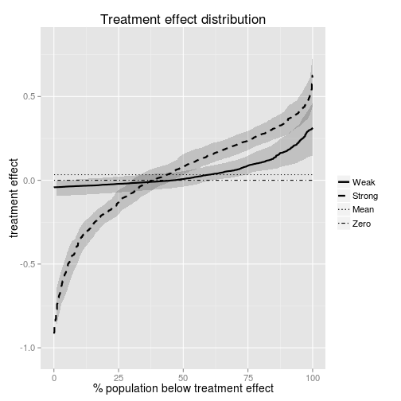
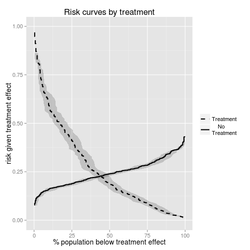

September 2 2013
Tutorial for Rpackage TreatmentSelection 
========================================================

This tutorial uses the Treatment Selection package to analyze the example data provided in the package.


First, you need to download and install the package from github using:


```r
if (!require("devtools")) install.packages("devtools")
devtools::install_github("TreatmentSelection", "mdbrown")

```

Alternatively, you could download the package from [here](http://labs.fhcrc.org/janes/) and install the package locally. 


Next load the package and look at the example data called `tsdata`. Four markers are included in the data example, a ''weak'' and a ''strong'' marker ($Y1$ and $Y2$ respectively), along with corresponding discrete versions. 


```r
library(TreatmentSelection)

data(tsdata)

tsdata[1:5, ]
```

```
##   trt event     Y1      Y2 Y1_disc Y2_disc
## 1   1     1 39.912 -0.8535       0       1
## 2   1     0  6.682  0.2905       1       0
## 3   1     0  6.582  0.0800       1       0
## 4   0     0  1.358  1.1925       1       0
## 5   0     0  7.682 -0.2070       1       1
```


Create TrtSel objects
-------------------------

Once we have the package and our data loaded into R, we need to create a treatment selection R object using the function `trtsel`. This function takes as inputs a data.frame of treatment indicators, adverse event status, marker values, and other optional information. Once we have created this object, we can then use it to plot risk/treatment effect curves, estimate summary measures, and check model calibration. 

First let's create a `trtsel` object using the weak marker data `Y1`, and take a look at it's contents:


```r
trtsel.Y1 <- trtsel(event = "event", trt = "trt", marker = "Y1", data = tsdata, 
    study.design = "randomized cohort", link = "logit", default.trt = "trt all")

trtsel.Y1
```

```
## Study design: randomized cohort 
## 
## Model Fit:
## 
##  Link function: logit 
## 
##  Coefficients: 
##             Estimate Std. Error z value  Pr(>|z|)
## (Intercept) -2.51814   0.235643 -10.686 1.180e-26
## trt          0.48939   0.311763   1.570 1.165e-01
## marker       0.04760   0.006454   7.376 1.636e-13
## trt:marker  -0.02319   0.008324  -2.786 5.340e-03
## 
## 
## Derived Data: (first ten rows)
## 
##    trt event marker fittedrisk.t0 fittedrisk.t1 trt.effect marker.neg
## 1    1     1 39.912       0.35017        0.2584   0.091792          0
## 2    1     0  6.682       0.09974        0.1340  -0.034304          1
## 3    1     0  6.582       0.09932        0.1338  -0.034447          1
## 4    0     0  1.358       0.07918        0.1197  -0.040482          1
## 5    0     0  7.682       0.10410        0.1369  -0.032806          1
## 6    0     0 41.172       0.36393        0.2643   0.099621          0
## 7    1     0 19.492       0.16934        0.1747  -0.005325          1
## 8    1     1 20.822       0.17843        0.1794  -0.000962          1
## 9    0     0  6.962       0.10095        0.1348  -0.033896          1
## 10   0     0  2.502       0.08325        0.1226  -0.039393          1
```


As we see above, the object contains information about the study design, model fit, fitted risks given treatment, and estimated treatment effect for each individual. To access information regarding the model fit, type:


```r
trtsel.Y1$model.fit
```


and to access the data derived from modelling (`derived.data`):


```r
Y1derived.data <- trtsel.Y1$derived.data

head(Y1derived.data)
```

```
##   trt event marker fittedrisk.t0 fittedrisk.t1 trt.effect marker.neg
## 1   1     1 39.912       0.35017        0.2584    0.09179          0
## 2   1     0  6.682       0.09974        0.1340   -0.03430          1
## 3   1     0  6.582       0.09932        0.1338   -0.03445          1
## 4   0     0  1.358       0.07918        0.1197   -0.04048          1
## 5   0     0  7.682       0.10410        0.1369   -0.03281          1
## 6   0     0 41.172       0.36393        0.2643    0.09962          0
```


Now create a `trtsel` object using a discrete marker. 


```r
# Y2_disc = as.numeric(Y2>0)
trtsel.Y2_disc <- trtsel(event = "event", trt = "trt", marker = "Y2_disc", data = tsdata, 
    study.design = "randomized cohort", link = "logit")
```


See `?trtsel` for more information. 

Use the plot function
--------------------------

Plot risk curves:


```r
tmp <- plot.trtsel(trtsel.Y1, main = "Y1: Oncotype-DX-like marker", plot.type = "risk", 
    ci = "horizontal", conf.bands = TRUE, bootstraps = 50, trt.names = c("chemo.", 
        "no chemo."))
```

 


For a binary marker, we can only calculate vertical confidence bands:


```r
tmp <- plot.trtsel(trtsel.Y2_disc, main = "Discrete version of Y2", plot.type = "risk", 
    ci = "vertical", conf.bands = TRUE, offset = 0.01, bootstraps = 50, trt.names = c("chemo.", 
        "no chemo."))
```

 


`tmp` is now a list with elements `plot` that holds the ggplot output, and `ci.bounds` which holds the information regarding the confidence bounds. 


```r
tmp$ci.bounds
```

```
##      risk trt marker   lower   upper
## 1 0.35985   1      1 0.31566 0.41389
## 2 0.06198   1      0 0.03259 0.09351
## 4 0.32061   0      0 0.26208 0.36023
## 5 0.17241   0      1 0.12185 0.23749
```


We can also plot the distribution of treatment effects. 


```r
plot.trtsel(trtsel.Y1, plot.type = "treatment effect", ci = "horizontal", conf.bands = TRUE, 
    bootstraps = 50)
```

 


```r
plot.trtsel(trtsel.Y2_disc, plot.type = "treatment effect", conf.bands = TRUE, 
    bootstraps = 50)
```

 


Evaluate marker performance
----------------------------------


```r
tmp <- eval.trtsel(trtsel.Y1, bootstraps = 50)
tmp
```

```
## 
## 
##   Hypothesis test:
##  ------------------
##   H0: No marker-by-treatment interaction
##                                        P value = 0.00534
##                                        Z statistic = -2.786
## 
##   Summary Measure Estimates (with 95% confidence intervals) 
##  -----------------------------------------------------------
##   Decrease in event rate under marker-based treatment (Theta)
##     Empirical:    0.013 (-0.007,0.042) 
##     Model Based:  0.01 (0,0.04) 
## 
##   Proportion marker negative:
##    0.461 (0.047,0.646) 
##   Proportion marker positive:
##    0.539 (0.354,0.953) 
## 
##   Average benefit of no treatment among marker-negatives (B.neg)
##     Empirical:    0.029 (-0.052,0.092) 
##     Model Based:  0.023 (0.002,0.064) 
## 
##   Average benefit of treatment among marker-positives (B.pos)
##     Empirical:    0.089 (0.033,0.157) 
##     Model Based:  0.098 (0.056,0.159) 
## 
## 
##   Variance in estimated treatment effect: 
##     0.007 (0.003,0.018) 
##   Total Gain: 
##     0.066 (0.038,0.106) 
## 
##   Marker positivity threshold:  21.08
## 
##   Event Rates:
##  --------------------
##              Treat all       Treat None    Marker-based Treatment
##  Empirical:     0.251           0.217          0.204    
##             (0.213,0.296)   (0.190,0.245)   (0.178,0.240) 
##  Model Based:   0.257           0.214          0.204    
##             (0.222,0.299)   (0.187,0.243)   (0.181,0.227)
```


```r
# access the estimates
tmp$estimates
```


```r
# discrete marker
eval.trtsel(trtsel.Y2_disc, bootstraps = 50)
```

```
## 
## 
##   Hypothesis test:
##  ------------------
##   H0: No marker-by-treatment interaction
##                                        P value = 0
##                                        Z statistic = 8.045
## 
##   Summary Measure Estimates (with 95% confidence intervals) 
##  -----------------------------------------------------------
##   Decrease in event rate under marker-based treatment (Theta)
##     Empirical:    0.093 (0.063,0.127) 
##     Model Based:  0.093 (0.063,0.127) 
## 
##   Proportion marker negative:
##    0.496 (0.463,0.53) 
##   Proportion marker positive:
##    0.504 (0.47,0.537) 
## 
##   Average benefit of no treatment among marker-negatives (B.neg)
##     Empirical:    0.187 (0.126,0.259) 
##     Model Based:  0.187 (0.126,0.259) 
## 
##   Average benefit of treatment among marker-positives (B.pos)
##     Empirical:    0.259 (0.205,0.337) 
##     Model Based:  0.259 (0.205,0.337) 
## 
## 
##   Event Rates:
##  --------------------
##              Treat all       Treat None    Marker-based Treatment
##  Empirical:     0.251           0.217          0.124    
##             (0.214,0.289)   (0.193,0.251)   (0.102,0.146) 
##  Model Based:   0.247           0.210          0.117    
##             (0.211,0.281)   (0.185,0.240)   (0.093,0.137)
```


Assess model calibration
--------------------------------------------

Currently, model calibration is only available for continuous markers. 


```r
calibrate.trtsel(trtsel.Y1, groups = 10, plot = "calibration", trt.names = c("chemo.", 
    "no chemo."))
```

 

```
## 
##   Hosmer - Lemeshow test for model calibration
##  ----------------------------------------------
## 
##    Number of Groups: 10 
## 
##    No Treatment (trt = 0):
##     Test Statistic = 4.496,   DF = 8,   p value = 0.8099
## 
##    Treated (trt = 1):
##     Test Statistic = 4.986,   DF = 8,   p value = 0.7591
```


See `?calibrate.trtsel` for more plot options. 


Compare markers
---------------------------------------

To compare markers, the trt and event labels must be identical for the two markers. Plots can not be generated if comparing a discrete marker with a continuous marker. 


```r
# trtsel object for the stronger marker 2
trtsel.Y2 <- trtsel(event = "event", trt = "trt", marker = "Y2", data = tsdata, 
    default.trt = "trt all")

# Compare the markers based on summary measures
mycompare <- compare.trtsel(trtsel1 = trtsel.Y1, trtsel2 = trtsel.Y2, marker.names = c("Weak", 
    "Strong"), bootstraps = 50, plot = TRUE, ci = "vertical", offset = 0.01, 
    conf.bands = TRUE)
```

 

```r
mycompare
```

```
##                       Summary Measure Estimates 
##                     (with  95 % confidence intervals) 
## 
##                marker 1    |    marker 2    |   difference    (p-value)
##  ------------------------------------------------------------------------
## 
## Decrease in event rate under marker-based treatment (Theta)
##  Empirical:     0.013      |     0.090     |     -0.076         (< 0.02)
##             (-0.008,0.171) | (0.056,0.251) | (-0.106,-0.050) 
##  Model Based:   0.010      |     0.099      |     -0.088         (< 0.02)
##             (0.000,0.030)  | (0.072,0.119)  | (-0.113,-0.041) 
## 
## Proportion marker negative:
##                 0.461      |     0.377      |     0.084         (0.88)
##             (0.000,0.613)  | (0.306,0.458)  | (-0.398,0.200) 
## Proportion marker positive:
##                 0.539      |     0.623      |     -0.084         (0.88)
##             (0.000,0.613)  | (0.306,0.458)  | (-0.398,0.200) 
## 
## Average benefit of no treatment among marker-negatives (B.neg)
##  Empirical:     0.029      |     0.238     |     -0.209         (< 0.02)
##             (-0.082,1.000) | (0.164,0.694) | (-0.338,0.398) 
##  Model Based:   0.023      |     0.262      |     -0.239         (< 0.02)
##             (0.000,0.063)  | (0.212,0.293)  | (-0.288,-0.111) 
## 
## Average benefit of treatment among marker-positives (B.pos)
##  Empirical:     0.089      |     0.203     |     -0.114         (< 0.02)
##             (0.041,0.050) | (0.167,0.297) | (-0.190,-0.185) 
##  Model Based:   0.098      |     0.211      |     -0.113         (< 0.02)
##             (0.050,0.157)  | (0.178,0.254)  | (-0.189,-0.053) 
## 
## 
## Variance in estimated treatment effect : 
##                 0.007      |     0.080      |     -0.073         (< 0.02)
##             (0.001,0.028)  | (0.056,0.124)  | (-0.099,-0.063) 
## 
## Total Gain: 
##                 0.066      |     0.224      |     -0.158         (< 0.02)
##             (0.024,0.022)  | (0.184,0.102)  | (-0.220,-0.047)
```


```r
## access the estimates and ci bounds.
mycompare$estimates.marker1  #estimates from trtsel1
mycompare$estimates.marker2
mycompare$ci.marker1
```


```r
## Compare two discrete markers Y1_disc = as.numeric(Y1>mean(Y1))
trtsel.Y1_disc <- trtsel(event = "event", trt = "trt", marker = "Y1_disc", data = tsdata, 
    study.design = "randomized cohort", link = "logit")


compare.trtsel(trtsel1 = trtsel.Y1_disc, trtsel2 = trtsel.Y2_disc, ci = "vertical", 
    offset = 0.2, bootstraps = 50, plot = TRUE, conf.bands = TRUE, annotate.plot = FALSE)
```

 

```
##                       Summary Measure Estimates 
##                     (with  95 % confidence intervals) 
## 
##                marker 1    |    marker 2    |   difference    (p-value)
##  ------------------------------------------------------------------------
## 
## Decrease in event rate under marker-based treatment (Theta)
##  Empirical:     0.011      |     0.093     |     -0.082         (< 0.02)
##             (-0.023,0.175) | (0.061,0.297) | (-0.114,-0.078) 
##  Model Based:   0.011      |     0.093      |     -0.082         (< 0.02)
##             (-0.023,0.041)  | (0.061,0.125)  | (-0.114,-0.046) 
## 
## Proportion marker negative:
##                 0.570      |     0.496      |     0.074         (< 0.02)
##             (0.543,0.599)  | (0.461,0.526)  | (0.044,0.114) 
## Proportion marker positive:
##                 0.430      |     0.504      |     -0.074         (< 0.02)
##             (0.543,0.599)  | (0.461,0.526)  | (0.044,0.114) 
## 
## Average benefit of no treatment among marker-negatives (B.neg)
##  Empirical:     0.019      |     0.187     |     -0.168         (< 0.02)
##             (-0.039,0.457) | (0.118,0.539) | (-0.230,-0.044) 
##  Model Based:   0.019      |     0.187      |     -0.168         (< 0.02)
##             (-0.039,0.069)  | (0.118,0.248)  | (-0.230,-0.108) 
## 
## Average benefit of treatment among marker-positives (B.pos)
##  Empirical:     0.106      |     0.259     |     -0.153         (< 0.02)
##             (-0.022,0.069) | (0.176,0.248) | (-0.241,-0.108) 
##  Model Based:   0.106      |     0.259      |     -0.153         (< 0.02)
##             (-0.022,0.175)  | (0.176,0.297)  | (-0.241,-0.078) 
## 
## 
## Variance in estimated treatment effect : 
##                 0.004      |     0.050      |     -0.046         (< 0.02)
##             (0.000,0.041)  | (0.026,0.125)  | (-0.064,-0.046) 
## 
## Total Gain: 
##                 0.061      |     0.223      |     -0.162         (< 0.02)
##             (0.008,0.011)  | (0.160,0.064)  | (-0.232,-0.021)
```


See `?compare.trtsel` for a list of all output values.

