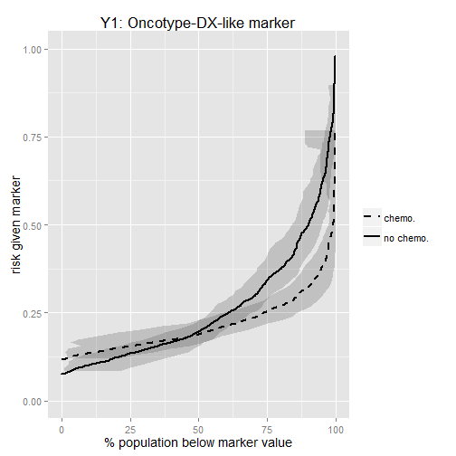
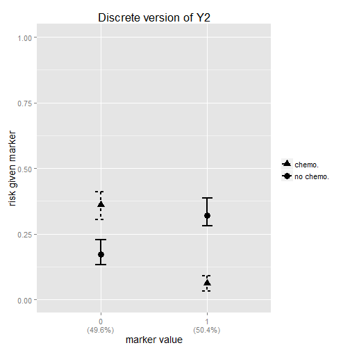
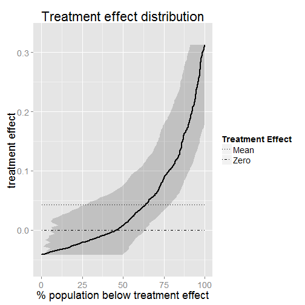
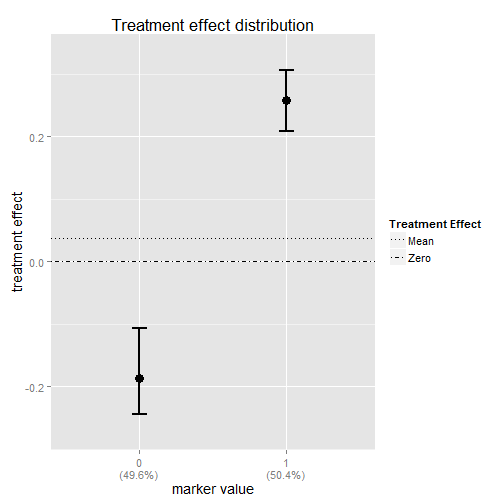
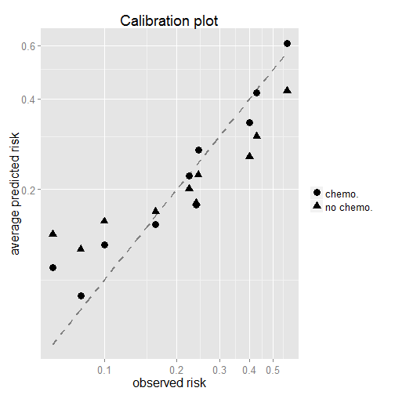
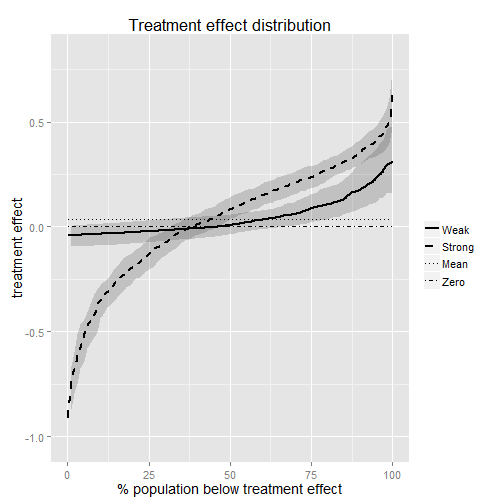
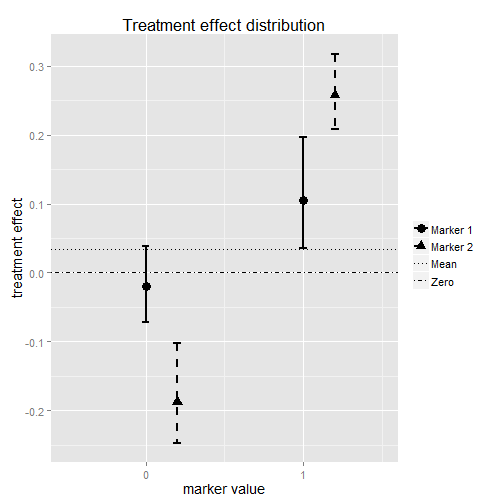
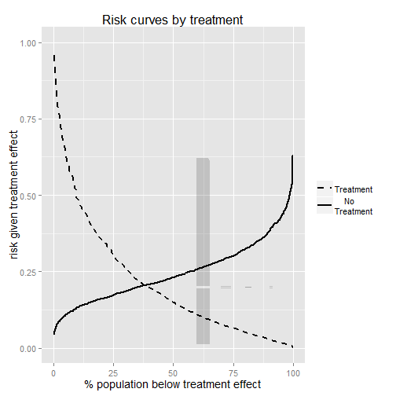

Last updated December 2013

Tutorial for R package TreatmentSelection 
========================================================

This tutorial uses the Treatment Selection package (version 1.1.0) to analyze the example data provided in the package.


First, you need to download and install the package from github using:


```r
if (!require("devtools")) install.packages("devtools")
devtools::install_github("TreatmentSelection", "mdbrown")
```


Alternatively, you could download the package from [here](http://mdbrown.github.io/TreatmentSelection/) and install the package locally. 


```r
library(TreatmentSelection)
```

```
## Loading required package: ggplot2
## Loading required package: grid
```


First, load the data called `tsdata`. Four markers are included in the data example, a ''weak'' and a ''strong'' marker ($Y1$ and $Y2$ respectively), along with a weak/strong discrete markers. 


```r
data(tsdata)

tsdata[1:5, ]
```

```
##   trt event     Y1      Y2 Y1_disc Y2_disc
## 1   1     1 39.912 -0.8535       1       0
## 2   1     0  6.682  0.2905       0       1
## 3   1     0  6.582  0.0800       0       1
## 4   0     0  1.358  1.1925       0       1
## 5   0     0  7.682 -0.2070       0       0
```


Create TrtSel objects
-------------------------

Once we have the package and our data loaded into R, we need to create a treatment selection R object using the function `trtsel`. This function takes as inputs a data.frame of treatment indicators, adverse event status, marker values, and other optional information. Once we have created this object, we can then use it to plot risk/treatment effect curves, estimate summary measures, and check model calibration. 

First let's create a `trtsel` object using the weak marker data `Y1`, and take a look at it's contents:


```r
trtsel.Y1 <- trtsel(event = "event", trt = "trt", marker = "Y1", data = tsdata, 
    study.design = "randomized cohort", link = "logit", default.trt = "trt all")

trtsel.Y1
```

```
## Study design: randomized cohort 
## 
## Model Fit:
## 
##  Link function: logit 
## 
##  Coefficients: 
##             Estimate Std. Error z value  Pr(>|z|)
## (Intercept) -2.51814   0.235643 -10.686 1.180e-26
## trt          0.48939   0.311763   1.570 1.165e-01
## marker       0.04760   0.006454   7.376 1.636e-13
## trt:marker  -0.02319   0.008324  -2.786 5.340e-03
## 
## 
## Derived Data: (first ten rows)
## 
##    trt event marker fittedrisk.t0 fittedrisk.t1 trt.effect marker.neg
## 1    1     1 39.912       0.35017        0.2584   0.091792          0
## 2    1     0  6.682       0.09974        0.1340  -0.034304          1
## 3    1     0  6.582       0.09932        0.1338  -0.034447          1
## 4    0     0  1.358       0.07918        0.1197  -0.040482          1
## 5    0     0  7.682       0.10410        0.1369  -0.032806          1
## 6    0     0 41.172       0.36393        0.2643   0.099621          0
## 7    1     0 19.492       0.16934        0.1747  -0.005325          1
## 8    1     1 20.822       0.17843        0.1794  -0.000962          1
## 9    0     0  6.962       0.10095        0.1348  -0.033896          1
## 10   0     0  2.502       0.08325        0.1226  -0.039393          1
```


As we see above, the object contains information about the study design, model fit, fitted risks given treatment, and estimated treatment effect for each individual. 

Now create a `trtsel` object using a discrete marker. 


```r
# Y2_disc = as.numeric(Y2>0)
trtsel.Y2_disc <- trtsel(event = "event", trt = "trt", marker = "Y2_disc", data = tsdata, 
    study.design = "randomized cohort", link = "logit")
```


See `?trtsel` for more information. Now that we have created trtsel objects, we can plot, evaluate, calibrate and compare them. 

Use the plot function
--------------------------

Plot risk curves:


```r
plot.trtsel(trtsel.Y1, 
            main = "Y1: Oncotype-DX-like marker", 
            plot.type = "risk", 
            ci = "horizontal", 
            conf.bands = TRUE, 
            bootstraps = 50,       #more bootstraps should be run than this in practice!
            trt.names = c("chemo.", "no chemo."), 
            show.marker.axis = FALSE)
```

 


For a binary marker, we calculate vertical confidence bands:


```r
tmp <- plot.trtsel(trtsel.Y2_disc, main = "Discrete version of Y2", plot.type = "risk", 
    ci = "vertical", conf.bands = TRUE, offset = 0.01, bootstraps = 50, trt.names = c("chemo.", 
        "no chemo."))
```

 


`tmp` is now a list with elements `plot` that holds the ggplot output, and `ci.bounds` which holds the information regarding the confidence bounds. 


```r
tmp$ci.bounds
```

```
##      risk trt marker   lower   upper
## 1 0.35985   1      0 0.31063 0.43142
## 2 0.06198   1      1 0.03911 0.08569
## 4 0.32061   0      1 0.26867 0.37680
## 5 0.17241   0      0 0.13878 0.21262
```


We can also plot the distribution of treatment effects. 


```r
plot.trtsel(trtsel.Y1, plot.type = "treatment effect", ci = "horizontal", conf.bands = TRUE, 
    bootstraps = 50)
```

 


```r
plot.trtsel(trtsel.Y2_disc, plot.type = "treatment effect", conf.bands = TRUE, 
    bootstraps = 50)
```

 


Evaluate marker performance
----------------------------------
Calculate summary measures of marker performance along with bootstrap confidence intervals.


```r
tmp <- eval.trtsel(trtsel.Y1, bootstraps = 50)
tmp
```

```
## 
## 
##   Hypothesis test:
##  ------------------
##   H0: No marker-by-treatment interaction
##                                        P value = 0.00534
##                                        Z statistic = -2.786
## 
##   Summary Measure Estimates (with 95% confidence intervals) 
##  -----------------------------------------------------------
##   Decrease in event rate under marker-based treatment (Theta)
##     Empirical:    0.013 (-0.008,0.05) 
##     Model Based:  0.01 (0,0.044) 
## 
##   Proportion marker negative:
##    0.461 (0,0.689) 
##   Proportion marker positive:
##    0.539 (0.311,1) 
## 
##   Average benefit of no treatment among marker-negatives (B.neg)
##     Empirical:    0.029 (-0.052,0.084) 
##     Model Based:  0.023 (0,0.071) 
## 
##   Average benefit of treatment among marker-positives (B.pos)
##     Empirical:    0.089 (0.011,0.15) 
##     Model Based:  0.098 (0.032,0.15) 
## 
## 
##   Variance in estimated treatment effect: 
##     0.007 (0.001,0.018) 
##   Total Gain: 
##     0.066 (0.024,0.103) 
## 
##   Marker positivity threshold:  21.08
## 
##   Event Rates:
##  --------------------
##              Treat all       Treat None    Marker-based Treatment
##  Empirical:     0.217           0.251          0.204    
##             (0.198,0.263)   (0.224,0.292)   (0.184,0.245) 
##  Model Based:   0.214           0.257          0.204    
##             (0.192,0.258)   (0.230,0.294)   (0.184,0.234)
```


```r
# access the estimates
tmp$estimates
```

```
##   p.neg p.pos B.neg.emp B.neg.mod B.pos.emp B.pos.mod Theta.emp Theta.mod
## 1 0.461 0.539   0.02865   0.02253   0.08867   0.09846   0.01321   0.01039
##   Var.Delta      TG ER.trt0.emp ER.trt0.mod ER.trt1.emp ER.trt1.mod
## 1  0.007416 0.06579       0.251      0.2568      0.2174      0.2141
##   ER.mkrbased.emp ER.mkrbased.mod Marker.Thresh
## 1          0.2042          0.2037         21.08
```


```r
# discrete marker
eval.trtsel(trtsel.Y2_disc, bootstraps = 50)
```

```
## 
## 
##   Hypothesis test:
##  ------------------
##   H0: No marker-by-treatment interaction
##                                        P value = 0
##                                        Z statistic = -8.045
## 
##   Summary Measure Estimates (with 95% confidence intervals) 
##  -----------------------------------------------------------
##   Decrease in event rate under marker-based treatment (Theta)
##     Empirical:    0.093 (0.055,0.124) 
##     Model Based:  0.093 (0.055,0.124) 
## 
##   Proportion marker negative:
##    0.496 (0.458,0.522) 
##   Proportion marker positive:
##    0.504 (0.478,0.542) 
## 
##   Average benefit of no treatment among marker-negatives (B.neg)
##     Empirical:    0.187 (0.108,0.247) 
##     Model Based:  0.187 (0.108,0.247) 
## 
##   Average benefit of treatment among marker-positives (B.pos)
##     Empirical:    0.259 (0.184,0.316) 
##     Model Based:  0.259 (0.184,0.316) 
## 
## 
##   Event Rates:
##  --------------------
##              Treat all       Treat None    Marker-based Treatment
##  Empirical:     0.217           0.251          0.124    
##             (0.186,0.246)   (0.222,0.291)   (0.098,0.156) 
##  Model Based:   0.210           0.247          0.117    
##             (0.182,0.239)   (0.218,0.288)   (0.094,0.145)
```


Assess model calibration
--------------------------------------------

Currently, model calibration is only available for continuous markers. 


```r
calibrate.trtsel(trtsel.Y1, groups = 10, plot = "calibration", trt.names = c("chemo.", 
    "no chemo."))
```

 

```
## 
##   Hosmer - Lemeshow test for model calibration
##  ----------------------------------------------
## 
##    Number of Groups: 10 
## 
##    No Treatment (trt = 0):
##     Test Statistic = 4.496,   DF = 8,   p value = 0.8099
## 
##    Treated (trt = 1):
##     Test Statistic = 4.986,   DF = 8,   p value = 0.7591
```


See `?calibrate.trtsel` for more plot options. 


Compare markers
---------------------------------------

To compare markers, the trt and event labels must be identical for the two markers. Plots can not be generated if comparing a discrete marker with a continuous marker. 


```r
# trtsel object for the stronger marker 2
trtsel.Y2 <- trtsel(event = "event", trt = "trt", marker = "Y2", data = tsdata, 
    default.trt = "trt all")

# Compare the markers based on summary measures
mycompare <- compare.trtsel(trtsel1 = trtsel.Y1, trtsel2 = trtsel.Y2, marker.names = c("Weak", 
    "Strong"), bootstraps = 50, plot = TRUE, ci = "vertical", offset = 0.01, 
    conf.bands = TRUE)
```

 

```r
mycompare
```

```
##                       Summary Measure Estimates 
##                     (with  95 % confidence intervals) 
## 
##                marker 1    |    marker 2    |   difference    (p-value)
##  ------------------------------------------------------------------------
## 
## Decrease in event rate under marker-based treatment (Theta)
##  Empirical:     0.013      |     0.090     |     -0.076         (< 0.02)
##             (-0.004,0.150) | (0.068,0.255) | (-0.113,-0.048) 
##  Model Based:   0.010      |     0.099      |     -0.088         (< 0.02)
##             (0.000,0.043)  | (0.073,0.124)  | (-0.110,-0.048) 
## 
## Proportion marker negative:
##                 0.461      |     0.377      |     0.084         (0.6)
##             (0.004,0.646)  | (0.304,0.478)  | (-0.351,0.211) 
## Proportion marker positive:
##                 0.539      |     0.623      |     -0.084         (0.58)
##             (0.354,0.996)  | (0.522,0.696)  | (-0.211,0.351) 
## 
## Average benefit of no treatment among marker-negatives (B.neg)
##  Empirical:     0.029      |     0.238     |     -0.209         (< 0.02)
##             (-0.062,0.071) | (0.186,0.317) | (-0.320,-0.123) 
##  Model Based:   0.023      |     0.262      |     -0.239         (< 0.02)
##             (0.000,0.067)  | (0.216,0.318)  | (-0.298,-0.180) 
## 
## Average benefit of treatment among marker-positives (B.pos)
##  Empirical:     0.089      |     0.203     |     -0.114         (< 0.02)
##             (0.019,0.141) | (0.163,0.274) | (-0.193,-0.069) 
##  Model Based:   0.098      |     0.211      |     -0.113         (< 0.02)
##             (0.050,0.150)  | (0.174,0.255)  | (-0.158,-0.048) 
## 
## 
## Variance in estimated treatment effect : 
##                 0.007      |     0.080      |     -0.073         (< 0.02)
##             (0.002,0.018)  | (0.061,0.107)  | (-0.099,-0.051) 
## 
## Total Gain: 
##                 0.066      |     0.224      |     -0.158         (< 0.02)
##             (0.036,0.103)  | (0.195,0.262)  | (-0.200,-0.112)
```


```r
## Compare two discrete markers Y1_disc = as.numeric(Y1>mean(Y1))
trtsel.Y1_disc <- trtsel(event = "event", trt = "trt", marker = "Y1_disc", data = tsdata, 
    study.design = "randomized cohort", link = "logit")


compare.trtsel(trtsel1 = trtsel.Y1_disc, trtsel2 = trtsel.Y2_disc, ci = "vertical", 
    offset = 0.2, bootstraps = 50, plot = TRUE, conf.bands = TRUE, annotate.plot = FALSE)
```

 

```
##                       Summary Measure Estimates 
##                     (with  95 % confidence intervals) 
## 
##                marker 1    |    marker 2    |   difference    (p-value)
##  ------------------------------------------------------------------------
## 
## Decrease in event rate under marker-based treatment (Theta)
##  Empirical:     0.011      |     0.093     |     -0.082         (< 0.02)
##             (-0.013,0.170) | (0.049,0.316) | (-0.108,-0.067) 
##  Model Based:   0.011      |     0.093      |     -0.082         (< 0.02)
##             (-0.013,0.036)  | (0.049,0.133)  | (-0.108,-0.045) 
## 
## Proportion marker negative:
##                 0.570      |     0.496      |     0.074         (< 0.02)
##             (0.543,0.595)  | (0.465,0.522)  | (0.037,0.108) 
## Proportion marker positive:
##                 0.430      |     0.504      |     -0.074         (< 0.02)
##             (0.405,0.457)  | (0.478,0.535)  | (-0.108,-0.037) 
## 
## Average benefit of no treatment among marker-negatives (B.neg)
##  Empirical:     0.019      |     0.187     |     -0.168         (< 0.02)
##             (-0.023,0.062) | (0.102,0.262) | (-0.229,-0.094) 
##  Model Based:   0.019      |     0.187      |     -0.168         (< 0.02)
##             (-0.023,0.062)  | (0.102,0.262)  | (-0.229,-0.094) 
## 
## Average benefit of treatment among marker-positives (B.pos)
##  Empirical:     0.106      |     0.259     |     -0.153         (< 0.02)
##             (0.025,0.170) | (0.193,0.316) | (-0.215,-0.067) 
##  Model Based:   0.106      |     0.259      |     -0.153         (< 0.02)
##             (0.025,0.170)  | (0.193,0.316)  | (-0.215,-0.067) 
## 
## 
## Variance in estimated treatment effect : 
##                 0.004      |     0.050      |     -0.046         (< 0.02)
##             (0.000,0.012)  | (0.023,0.072)  | (-0.067,-0.018) 
## 
## Total Gain: 
##                 0.061      |     0.223      |     -0.162         (< 0.02)
##             (0.017,0.105)  | (0.151,0.267)  | (-0.221,-0.083)
```


See `?compare.trtsel` for more options.

Including fitted risks (*new option with version 1.1.0*)
----------------------------
Alternative to including a marker and fitting a logistic model, the user can specify fitted risks for trt = 0 and trt = 1. In this case, no model fitting will be implemented and all bootstrap confidence intervals will be conditional on the provided fitted model. 


```r
# calculate model fit
mymod <- glm(event ~ trt * Y2, data = tsdata, family = binomial("logit"))

tsdata$fitted.t0 <- predict(mymod, newdata = data.frame(trt = 0, Y2 = tsdata$Y2), 
    type = "response")
tsdata$fitted.t1 <- predict(mymod, newdata = data.frame(trt = 1, Y2 = tsdata$Y2), 
    type = "response")


myfitted.trtsel <- trtsel(event = "event", trt = "trt", data = tsdata, fittedrisk.t0 = "fitted.t0", 
    fittedrisk.t1 = "fitted.t1", study.design = "randomized cohort", default.trt = "trt all")
```


We can now use this `trtsel` object just as before, but confidence intervals will be smaller because we do not account for the variation due to model fitting. 


```r
plot.trtsel(myfitted.trtsel, bootstraps = 50, plot.type = "risk", ci = "horizontal", 
    show.marker.axis = FALSE)
```

 


References
------------------------
Janes H, Brown MD, Pepe MS, Huang Y. Statistical methods for evaluating and comparing biomarkers for patient treatment selection. *International Journal of Biostatistics* (under review).
